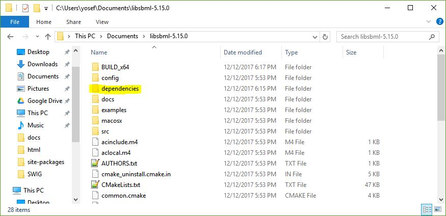
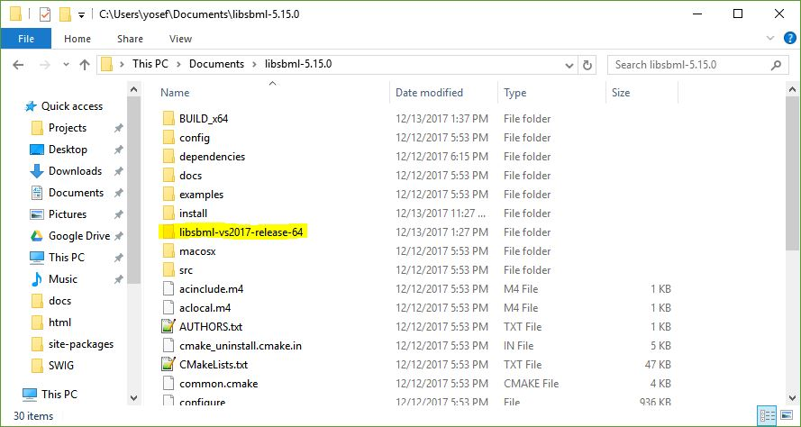
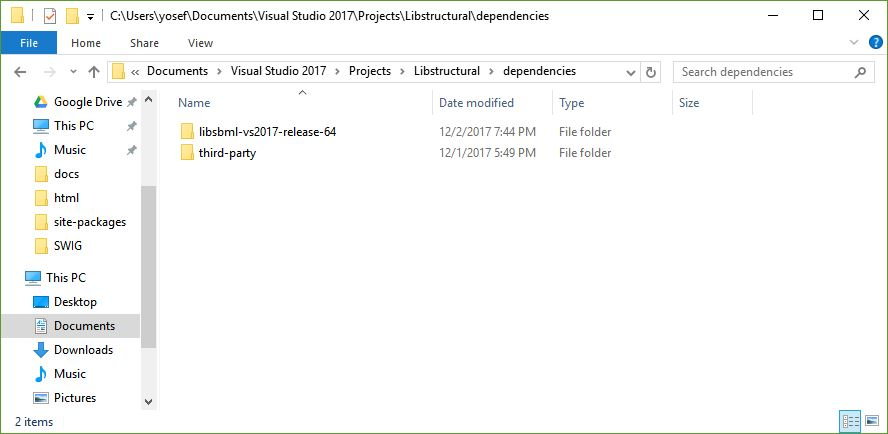
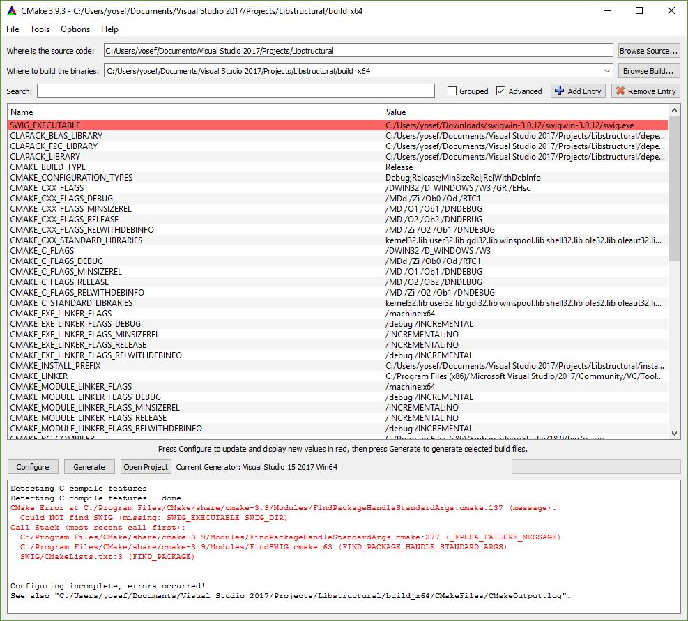
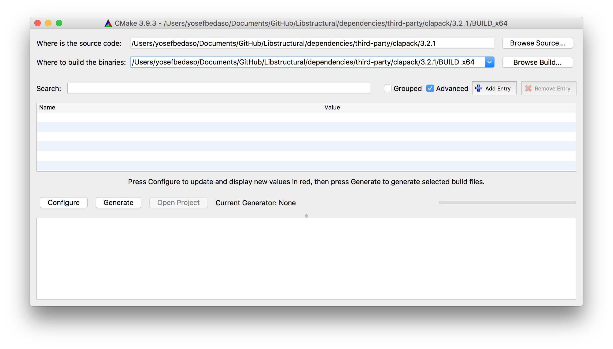
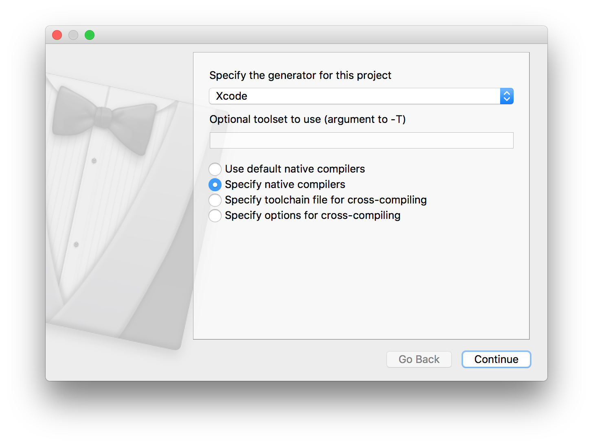
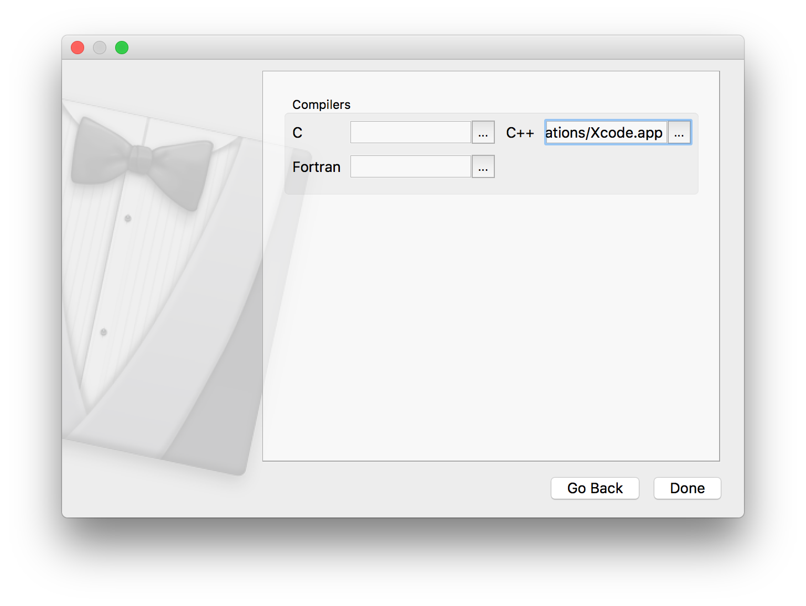
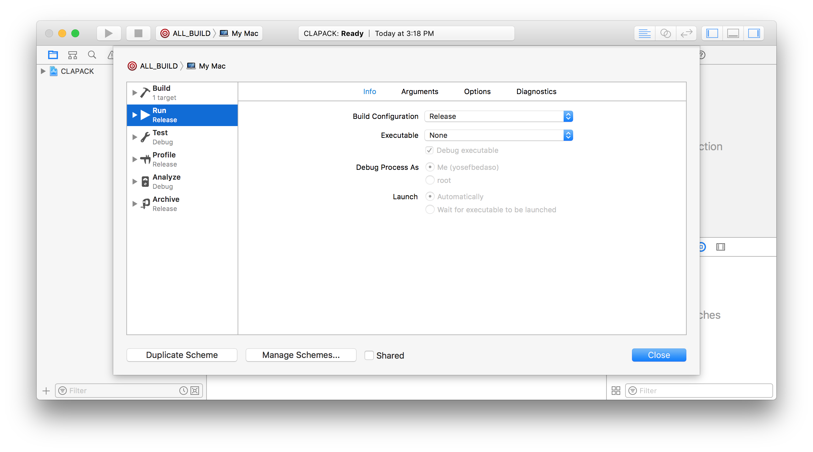

Building From Source
=====================

The LibStructural API library can be built on your machine from the source code found on `github <https://github.com/yosefmaru/Libstructural>`_. To build LibStructural, you will need:

* The LibStructural source code and dependencies from github (you will need `git <https://git-scm.com/>`_ to clone/download the repo).
* libSBML `dependencies package  <https://sourceforge.net/projects/sbml/files/libsbml/win-dependencies/>`_. Make sure to get the vs15_release_x64 version.
* `libSBML version 5.15.0 <https://sourceforge.net/projects/sbml/files/libsbml/5.15.0/stable/>`_ source code. Get the "libSBML-5.15.0-core-src.zip" version.
* `CMake version 3.9.3 <https://cmake.org/files/v3.9/>`_ for generating solution files.
* Visual Studio 2017 for Windows or Xcode for MacOS
* Python 2.7 for generating a python wrapper (optional)
* `SWIG <http://www.swig.org/>`_ for generating python wrappers in Windows (optional).

-------
Windows
-------
First, clone/download the Libstructural source code from the `github repo <https://github.com/yosefmaru/Libstructural>`_ by running the following command from the command line or git software:

``git clone https://github.com/yosefmaru/Libstructural``

Prior to building LibStructural on Windows, binaries for libSBML needs to be generated first. To do this you, will need a libSBML `dependencies package <https://sourceforge.net/projects/sbml/files/libsbml/win-dependencies/libSBML_dependencies_vs15_release_x64.zip/download>`_ and `source code <https://sourceforge.net/projects/sbml/files/libsbml/5.15.0/stable/libSBML-5.15.0-core-src.zip/download>`_. An issue on Windows concerns the dependency libraries on which libSBML depends. CMake will try to find all the dependencies for the default options, which leads to problems if they do not exist.
1. Extract the dependencies folder you downloaded into the same folder where you unpacked the libSBML source distribution. CMake will look for these dependencies in a folder called "dependencies" directly below the libSBML root folder.
2. rename the extracted libsbml dependencies folder from it's default name to "dependencies".

3. Once you have the libSBML sources and the dependency libraries unpacked on your system, start up the CMake graphical user interface (GUI).

Building libSBML
~~~~~~~~~~~~~~~~

A detailed step-by-step instruction can be found on this `link <http://sbml.org/Software/libSBML/5.16.0/docs//cpp-api/libsbml-installation.html>`_ on how to generate a solution file using CMake and build libSBML libraries on Visual Studio.
1. To be consistent with building LibStructural instructions, make sure to select "Visual Studio 15 2017 Win64" when selecting a generator on CMake.
2. Copy the directory inside "Where is the source code" inquiry to the CMAKE_INSTALL_PREFIX option and add "/libsbml-vs2017-release-64" to it as shown below.

.. figure:: libsbml_install_prefix.JPG
    :align: center
    :figclass: align-center

3. After generating the solution file make sure you build with a **Release** configuration, instead of **Debug** configuration on visual studio.
4. Build the solution file from the "INSTALL" target (i.e. on Visual Studio, right click on "INSTALL" and select Build). This target will install the compiled binaries to the directory specified on the CMAKE_INSTALL_PREFIX option, which is ".../libsbml-vs2017-release-64"

5. Once you complete building libSBML, copy the libsbml-vs2017-release-64 folder to "...Libstructural/dependencies" that you cloned/downloaded from github. This step is very important since the LibStructural CMakeLists configuration that generates the solution file looks for libSBML libraries inside a folder named "libsbml-vs2017-release-64". Thus, you should have "libsbml-vs2017-release-64" and "third-party" folders under dependencies.

The next step is building LibStructural.

Building LibStructural
~~~~~~~~~~~~~~~~~~~~~~

1. Open CMake-gui.
2. Click on the **Browse Source...** button and navigate to the directory where you cloned/downloaded the LibStructural folder on your file system.
3. For the "Where to build the binaries" inquiry, use the same directory, but add /BUILD_x64 to it.
4. On the CMake-gui click on **Configure**. A prompt will ask you to create a "BUILD_x64" folder inside LibStructural. Click on **Yes**.
5. Next, it will ask you to specify a generator for the project and what compiler to use as shown below. For the generator, select "Visual Studio 15 2017 Win64".
6. Select "Use default native compilers" option and click on **Finish**.

.. figure:: cmake_2.JPG
    :align: center
    :figclass: align-center

7. If you wish to generate a python wrapper, you will have to checkmark the "ENABLE_PYTHON_WRAPPER" option.
8. Click on **Configure** again and an error will appear in red on the top, asking for the location of a SWIG executable file.
9. Click on the "SWIG_EXECUTABLE-NOTFOUND" and copy or navigate to the swig.exe directory. The swig.exe file will be in the `SWIG <http://www.swig.org/>`_ folder you downloaded.
10. Click on **Generate**, and a LibStructural.sln file will be stored inside the BUILD_x64 folder.
**NOTE:** If you don't want to generate a python wrapper, simply click **Configure** and then **Generate** after step 2.

11. To build the libraries, open the solution file "LibStructural.sln" located in BUILD_x64 folder using Visual Studio 2017.
12. On Visual Studio, set the build target to "Release" instead of "Debug" with "x64" configuration.
13. Right click on **ALL_BUILD** and click on Build.

The built libraries and binaries will be stored in ".../BUILD_x64/LibStructural/Release" directory. If you chose to generate a python wrapper, it will be located inside INSTALL_x64/wrapper/structural.

----
Mac
----
For Mac, you will have to generate CLAPACK libraries in addition to libSBML. You need to generate MacOS compatible dependency libraries needed for building LibStructural. The CLAPACK source code is included in the LibStructural distribution that is cloned/downloaded from github. It is located inside the directory "...Libstructural/dependencies/third-party". However, the libSBML source code is the one you should `download <https://sourceforge.net/projects/sbml/files/libsbml/5.15.0/stable/libSBML-5.15.0-core-src.zip/download>`_ from sourceforge.

Building CLAPACK
~~~~~~~~~~~~~~~~
1. Open CMake-gui.
2. Click on the **Browse Source...** button and navigate to ".../dependencies/third-party/clapack/3.2.1" inside the Libstructural folder you cloned/downloaded.
3. For the "Where to build the binaries" inquiry, use the same directory, but add /BUILD_x64 to it as shown below.

4. Click on **Configure**. CMake will ask for what generator and compiler to use.
5. Find and select "Xcode" from the dropdown menu.
6. Select "Specify native compilers" and click on **Continue**.
7. On the next window, under C++ box, click on the three dots and navigate to your Xcode application. It should be inside the "Applications" folder by default. Click on **Done**.
8. Click on **Configure** and then **Generate.

9. Your Xcode project file will be generated inside "BUILD_x64" folder, or you can simply click on **Open Project** on CMake to automatically launch the project in Xcode.
10. Once Xcode finishes loading/indexing the project, go to **Product -> Scheme -> Edit Scheme** (keyboard shortcut: **Command + Shift + <**). You will need to set the Build Configuration to "Release".

11. Click on **Product -> Build** or the Play button.
12. The libraries will be stored inside BUILD_x64. There are three libraries you will need to locate:

* **libblas.a** which will be found in the directory ".../BUILD_x64/BLAS/SRC/Release".
* **libf2c.a** which will be found in the directory ".../BUILD_x64/F2CLIBS/libf2c/Release".
* **liblapack.a** inside ".../BUILD_x64/SRC/Release".

13. Copy these three libraries to ".../Libstructural/dependencies/third-party/clapack/3.2.1/LIB".

Building libSBML
~~~~~~~~~~~~~~~~
You will use the same steps as shown above with minor changes. Your source code is a `libSBML package <https://sourceforge.net/projects/sbml/files/libsbml/5.15.0/stable/libSBML-5.15.0-core-src.zip/download>`_ you downloaded from sourceforge.

1. On CMake, locate the folder to fill "Where is the source" inquiry (i.e. ".../Downloads/libsbml-5.15.0"). Then click on **Browse Build...* and use the same folder directory, but add "/BUILD_x64" to it. Click on **Configure**
2. Before generating the project file, copy the directory inside "Where is the source code" inquiry to the CMAKE_INSTALL_PREFIX option and add "/libsbml-vs2017-release-64" to it.
3. Click on **Configure** then **Generate**.
4. Open the Xcode project generated and go to **Product -> Scheme** to select "install".
5. Go to **Product -> Scheme -> Edit Scheme** (keyboard shortcut: Command + Shift + <). You will need to set the Build Configuration to "Release".
6. Click on **Product -> Build** or the Play button (keyboard shortcut: Command + B).
7. After building succeeds, a "libsbml-vs2017-release-64"" folder will be created inside ".../libsbml-5.15.0". Copy this folder in to ".../Libstructural/dependencies" directory. This step is very important since the LibStructural CMakeLists configuration that generates the Xcode project file looks for libSBML libraries inside a folder named "libsbml-vs2017-release-64".

Building LibStructural
~~~~~~~~~~~~~~~~~~~~~~
1. Open CMake-gui. For the "Where is the source code" inquiry, click on **Browse Source** and navigate to the directory where LibStructural is located at. For the "Where to build the binaries" inquiry, use the same directory, but add "/BUILD_x64" to it.
2. Follow steps 4-7 from the "Building CLAPACK" section.
3. If you chose to build a python wrapper, checkmark the "ENABLE_PYTHON_WRAPPER" value and configure again. If no errors are raised click on **Generate**. **Note:** You don't need to download SWIG as it is included in with your Mac OS.
4. Follow step three from the "Building CLAPACK" section.
5. Once Xcode finishes loading/indexing the project, go to **Product -> Scheme -> Edit Scheme** (keyboard shortcut: Command + Shift + <). You will need to set the Build Configuration to "Release". If you chose to generate python wrapper from step three, go to **Product -> Scheme** and select "install". Otherwise, click on **Product -> Build** or the Play button (keyboard shortcut: Command + B).
6. The built libraries and binaries will be stored in ".../BUILD_x64/LibStructural/Release" directory. If you chose to generate a python wrapper, the wrapper will be stored inside ".../INSTALL_x64/wrapper/structural".
