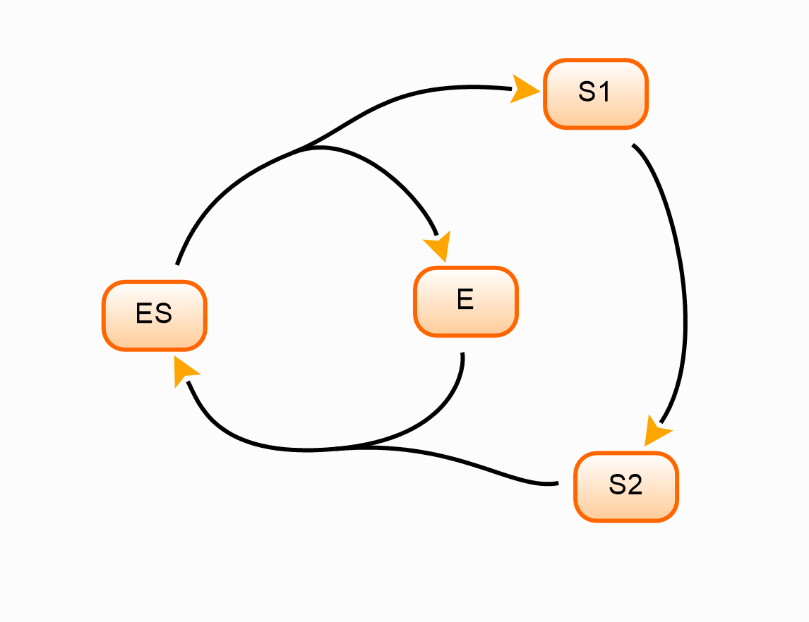
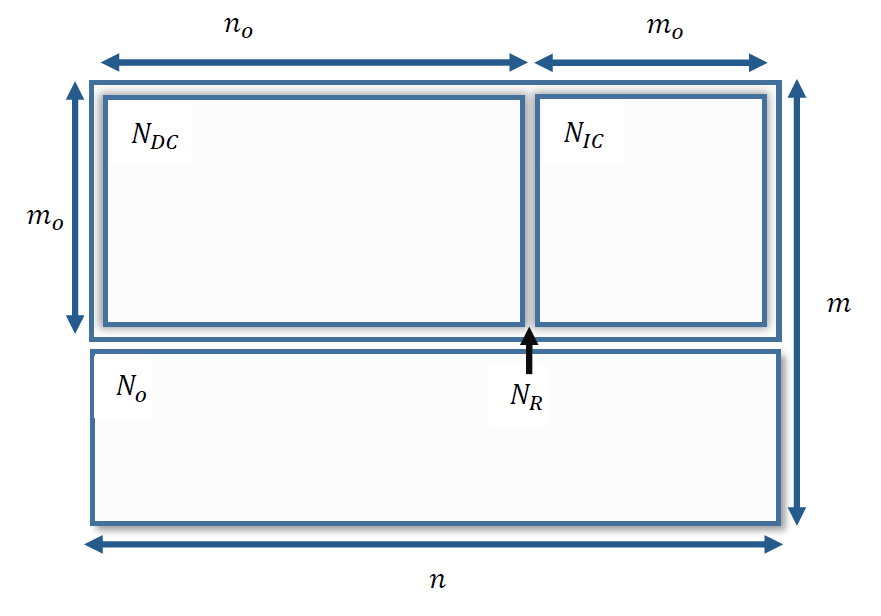

Getting Started with LibStructural
==================================

The following examples demonstrate how to load a biochemical reaction network into LibStructural API. A model should be available at least in one of the following formats: SBML model file (.xml format), or a 2D array matrix. SBML can either be loaded as a string or directly from a file.

----------------------
Testing LibStructural
----------------------
To test the structural module, you can use the **test()** method. This will print out an analysis summary of a Glycolysis/Gluconeogenesis SBML model (`BMID000000101155 <https://www.ebi.ac.uk/biomodels-main/BMID000000101155>`_) distributed with LibStructural. For example:

.. code:: python

  import structural
  ls = structural.LibStructural()
  ls.test()

.. end

In addition, a test script is distributed with LibStructural package that can be run to test the methods' integrity. The script checks that LibStructural methods don't crash when there is no model loaded. It also tests **loadStoichiometryMatrix** method. You can run the script as shown below:

.. code:: python

  import structural
  execfile(structural.__path__[0] + '/test/tests/testLibStructural.py')

.. end

The following sections describe different ways of loading a model into Libstructural. Once a model is loaded it will automatically call ``analyzeWithQR``. At this point a summary of the analysis can be obtained by calling **getSummary()**:

.. code:: python

  ls.getSummary()

.. end

-------------------------
Loading a model
-------------------------

To load a model into LibStructural, an instance variable must be created.

.. code:: python

    import structural
    ls = structural.LibStructural()

.. end

Loading a model from a file
~~~~~~~~~~~~~~~~~~~~~~~~~~~~~
A model can be loaded from an SBML file, for example:

.. code:: python

    ls.loadSBMLFromFile("iYO844.xml")

.. end

This assumes that the file is in the current directory. If not use the fill path name to the file.

Loading a model from a string
~~~~~~~~~~~~~~~~~~~~~~~~~~~~~

If a model is available as a SBML string, us the following code:

.. code:: python

    ls.loadSBMLFromString("example_SBMLstring")

.. end

This might occur of a model is specified using the Antimony syntax or is created from libSBML.

Loading a model from a stoichiometric matrix
~~~~~~~~~~~~~~~~~~~~~~~~~~~~~~~~~~~~~~~~~~~~

Models can also be loaded by specifying the stoichiometry matrix directly"

.. code:: python

    ls = structural.LibStructural()
    matrix = [[  1, -1, -1], [  0, -1,  1], [  0,  1, -1]] # matrix can be a numpy 2d array
    ls.loadStoichiometryMatrix(matrix)

.. end

The load command will also by default add reaction ids of the form '_Jx' and species ids of the form 'Sx'. To override these default names, see the section below.

Assigning Reaction and Species Ids
----------------------------------

When loading a model from a stoichiometry matrix, reactions and species can be optionally labelled.

.. code:: python

  import structural
  ls = structural.LibStructural()
  matrix = [[  1, -1, -1], [  0, -1,  1], [  0,  1, -1]] # matrix can also be a numpy 2d array

  print ls.getStoichiometryMatrix()
  print ls.getFloatingSpeciesIds()
  print ls.getReactionsIds()

  # load Ids
  ls.loadSpeciesIdsWithValues (['a', 'b', 'c'], [0, 0, 0]) # The array length for both ids list and values list should be equal to the number of species
  ls.loadReactionIdsWithValues (['F1', 'F2', 'F3'],[0, 0, 0])

  # Reanalyze with the new labels
  ls.analyzeWithQR()

  print ls.getFloatingSpeciesIds()
  print ls.getReactionsIds()

.. end

Loading a model using the antimony model description language
~~~~~~~~~~~~~~~~~~~~~~~~~~~~~~~~~~~~~~~~~~~~~~~~~~~~~~~~~~~~~

If you use `tellurium <http://tellurium.analogmachine.org/>`_ you can load a model by converting an antimony string into  a SBML string. For example:

.. code:: python

  import structural
  import tellurium as te

  r = te.loada('''
      // Reactions. All reactions have the dummy rate law 'v'
      // since we're not interested in dynamic simulation.
      J1: S1 -> S2; v;
      J2: -> S3; v;
      J3: S3 -> S1; v;

      # Initialize species
      S1 = 10; S2 = 10; S3 = 10;
      v = 0;
  ''')

  sbmlstr = r.getSBML() # this creates an SBML string from the antimony model, r.
  ls = structural.LibStructural()
  ls.loadSBMLFromString(sbmlstr)
  print(ls.getSummary())

  # An antimony model can be converted into SBML file as well
  r.exportToSBML('Test_model.xml') # creates an xml file in the current directory
  ls = structural.LibStructural()
  ls.loadSBMLFromFile('Test_model.xml') # loads the xml file from the current directory
  print(ls.getSummary())
.. end

-------------------------
Structural Analysis
-------------------------

The following examples show some of LibStructural's methods on two different models. The models were generated using tellurium by converting antimony description language to an SBML string.

Conserved Metabolic Network
~~~~~~~~~~~~~~~~~~~~~~~~~~~

Below is a network diagram that shows two interlinked conserved cycles: S1 + S2 + ES and ES + E:

To generate an SBML string and load the model to LibStructural, run:

.. code:: python

  import structural
  import tellurium as te

  r = te.loada('''
      // Reactions:
      J1: ES -> S1 + E; v;
      J2: S2 + E -> ES; v;
      J3: S1 -> S2; v;

      // Species Initialization
      S1 = 10; S2 = 10; ES = 10; E = 10;
      v = 0;
  ''')

  sbmlstr = r.getSBML() # this creates an SBML string from the antimony model, r.
  ls = structural.LibStructural()
  ls.loadSBMLFromString(sbmlstr)

.. end

Once the model is loaded we can run the getSummary function to get the analysis result of the analyzeWithQR function. NOTE: when loading a model on LibStructural, the analyzeWithQR method is called implicitly.

.. code:: python

  print(ls.getSummary()) # Prints out if the model is passed some internal structural validation tests.

.. end

.. code:: python

  print(ls.validateStructuralMatrices()) # Prints out if the model is passed some internal structural validation tests.

  # see what tests were run, call ls.getTestDetails()
  tests = ls.getTestDetails()
  print(tests)

.. end

To get the model's stoichiometry matrix we can run the following code:

.. code:: python

  # get the default, unaltered stoichiometric matrix
  print ls.getStoichiometryMatrix()

.. end

A stoichiometry matrix can be converted into a reordered matrix in which the rows are partitioned into N0 (linearly dependent rows) and Nr (linearly independent rows/reduced stoichiometry matrix). Dependent rows will be located on the top and independent rows will at the bottom.

.. code:: python

  # get a row reordered matrix (into dependent and independent rows)
  ls.getReorderedStoichiometryMatrix()

.. end

A fully reordered stoichiometry matrix is a matrix where the Nr section of the reordered stoichiometry matrix partitioned into NDC (linearly dependent columns) and NIC (linearly independent columns).

.. code:: python

  # get a column and row reordered stoichiometry matrix, run:
  ls.getFullyReorderedStoichiometryMatrix()

.. end

.. code:: python

  # get the NIC and NDC matrices
  ls.getNDCMatrix()
  ls.getNICMatrix() # NIC matrix is always a square matrix

  # get N0 and Nr matrices
  ls.getDependentReactionIds()

  # identify independent reactions (run respective methods for species)
  ls.getIndependentReactionIds()

.. end

We can also get species and reaction information from the model.

.. code:: python

  # get the number of dependent reactions (run respective methods for species)
  ls.getNumDepReactions()
  ls.getNumIndReactions()

  # identify dependent reactions (run respective methods for species)
  ls.getDependentReactionIds()

  # identify independent reactions (run respective methods for species)
  ls.getIndependentReactionIds()

  # check if a reaction is reversible or not by passing the reaction index.
  ls.isReactionReversible(0)

.. end

There are few methods that compute conserved moeties in the model:

.. code:: python

  # get the conserved matrix
  ls.getGammaMatrix()

  # get which species are contained in each row of the conserved matrix
  ls.getGammaMatrixIds()

  # get conserved laws and the conserved sums associated with them
  ls.getConservedLaws()

.. end

Branched Metabolic Network
~~~~~~~~~~~~~~~~~~~~~~~~~~

To compute the elementary modes the **getElementaryModes** method can be called. This returns an array where each row is an elementary mode in the model. Elementary modes are the simplest pathways within a metabolic network that can sustain a steady state and at the same time are thermodynamically feasible

.. code:: python

  import structural
  ls.getElementaryModes()

.. end

In addition, a test script for elementary modes is distributed with LibStructural package. The script contains 24 different test models and it calculates elementary modes in each model. You can run the script as shown below:

.. code:: python

  import structural
  execfile(structural.__path__[0] + '/test/tests/elementaryModes.py')

.. end
