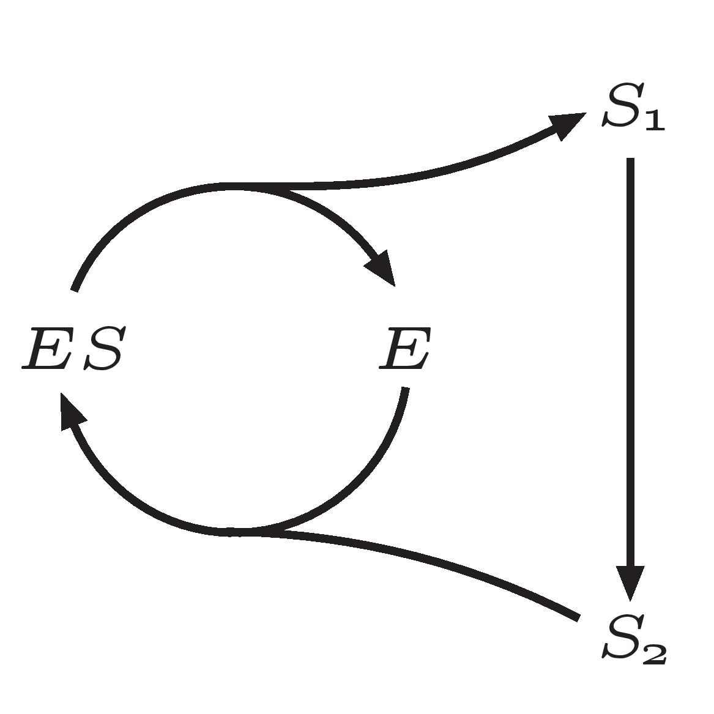
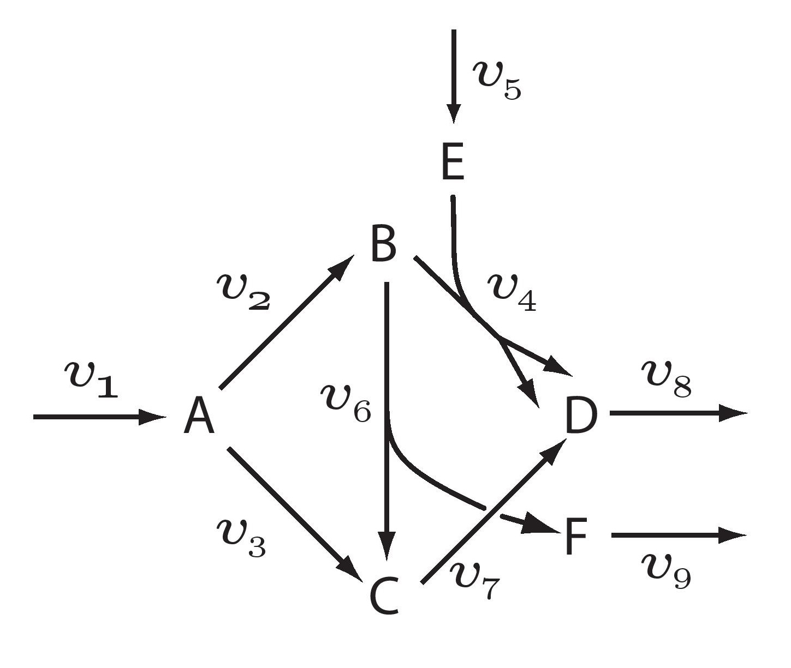

Getting Started with LibStructural
==================================

The following examples demonstrate how to load a biochemical reaction network using the LibStructural API. A model should
be available in at least one of the following formats: SBML model file (.xml format), or a 2D array. SBML can either be loaded as a string or directly from a file.

----------------------
Testing LibStructural
----------------------
To test the LibStructural module, you can use the **runLibstructTests()** method. This will print out a summary of various tests. These include: testing the integrity of the model loading methods, testing for error messages and conservation analysis methods. Thirty one toy models and a Glycolysis/Gluconeogenesis SBML model (`BMID000000101155 <https://www.ebi.ac.uk/biomodels-main/BMID000000101155>`_) are used for testing. For example:

.. code:: python

  import structural
  ls = structural.LibStructural()
  ls.runLibstructTests()

.. end

In addition, the test method **runElementaryModeTests()** runs an internal test suite on 31 toy models anyalysing the integrity of the elementary modes returned by **getElementaryModesInteger()** and **getElementaryModesDouble()**.

.. code:: python

  import structural
  ls = structural.LibStructural()
  ls.runElementaryModeTests()

.. end

The following sections describe different ways of loading a model into Libstructural. Once a model is loaded it will automatically call ``analyzeWithQR`` for analysing the stoichiometry matrix. At this point a summary of the analysis can be obtained by calling **getSummary()**:

.. code:: python

  ls.getSummary()

.. end

-------------------------
Loading a Model
-------------------------

To load a model into LibStructural, a LibStructural variable must first be created. All methods call are then routed via this variable.

.. code:: python

    import structural
    ls = structural.LibStructural()

.. end

Loading a Model from a File
~~~~~~~~~~~~~~~~~~~~~~~~~~~~~
A model can be loaded from an SBML file using the **loadSBMLFromFile()** method. For example:

.. code:: python

    ls.loadSBMLFromFile("iYO844.xml") # Pass file path if file is in different directory

.. end

Loading a model from a string
~~~~~~~~~~~~~~~~~~~~~~~~~~~~~

If a model is available as an SBML string, use the following code:

.. code:: python

    ls.loadSBMLFromString(sbmlString)

.. end

where **sbmlString** has been previously assigned an SBML string. SBML strings can be obtained either by loading the contents of a
file than contains SBML, creating an SBML model via simpleSBML or libSBML, or more commonly by converting an Antimony description of a model into SBML.

Loading a Model from a Stoichiometric Matrix
~~~~~~~~~~~~~~~~~~~~~~~~~~~~~~~~~~~~~~~~~~~~

Models can also be loaded by specifying the stoichiometry matrix directly as an array:

.. code:: python

    ls = structural.LibStructural()
    matrix = [[  1, -1, -1], [  0, -1,  1], [  0,  1, -1]] # matrix can be a numpy 2d array
    ls.loadStoichiometryMatrix(matrix)

.. end

The load command will also by default add reaction ids of the form '_Jx' and species ids of the form 'Sx'. To override these default names, see the section below.

Assigning Reaction and Species Ids
----------------------------------

When loading a model from a stoichiometry matrix, reactions and species Ids can be changed form their default values as follows.

.. code:: python

  import structural
  ls = structural.LibStructural()
  matrix = [[  1, -1, -1], [  0, -1,  1], [  0,  1, -1]] # matrix can also be a numpy 2d array
  ls.loadStoichiometryMatrix(matrix)
  print ls.getStoichiometryMatrix()
  print ls.getFloatingSpeciesIds()
  print ls.getReactionIds()

  # load new Ids
  ls.loadSpeciesIdsWithValues (['a', 'b', 'c'], [0, 0, 0]) # The array length for both ids list and values list should be equal to the number of species
  ls.loadReactionIdsWithValues (['F1', 'F2', 'F3'],[0, 0, 0])

  # Reanalyze with the new labels
  ls.analyzeWithQR()

  print ls.getFloatingSpeciesIds()
  print ls.getReactionIds()

.. end

Loading a model Using the Antimony Model Description Language
~~~~~~~~~~~~~~~~~~~~~~~~~~~~~~~~~~~~~~~~~~~~~~~~~~~~~~~~~~~~~

If you use `tellurium <http://tellurium.analogmachine.org/>`_ you can load a model by converting an antimony string into  a SBML string. For example:

.. code:: python

  import structural
  import tellurium as te

  r = te.loada('''
      // Reactions. All reactions have the dummy rate law 'v'
      // since we're not interested in dynamic simulation.
      J1: S1 -> S2; v;
      J2: -> S3; v;
      J3: S3 -> S1; v;

      # Initialize species
      S1 = 10; S2 = 10; S3 = 10;
      v = 0;
  ''')

  sbmlstr = r.getSBML() # this creates an SBML string from the antimony model, r.
  ls = structural.LibStructural()
  ls.loadSBMLFromString(sbmlstr)
  print(ls.getSummary())

  # A libRoadRunner model can be converted into SBML file as well
  r.exportToSBML('Test_model.xml') # creates an xml file in the current directory
  ls = structural.LibStructural()
  ls.loadSBMLFromFile('Test_model.xml') # loads the xml file from the current directory
  print(ls.getSummary())
.. end

-------------------------
Structural Analysis
-------------------------

The following examples show some of LibStructural's methods on two different models. The models were generated using Tellurium by converting the antimony description language into an SBML string.

Conserved Metabolic Network
~~~~~~~~~~~~~~~~~~~~~~~~~~~

Below is a network diagram that shows two interlinked conserved cycles: S1 + S2 + ES and ES + E:

To generate an SBML string and load the model to LibStructural, run:

.. code:: python

  import structural
  import tellurium as te

  r = te.loada('''
      // Reactions:
      J1: ES -> S1 + E; v;
      J2: S2 + E -> ES; v;
      J3: S1 -> S2; v;

      // Species Initialization
      S1 = 10; S2 = 10; ES = 10; E = 10;
      v = 0;
  ''')

  sbmlstr = r.getSBML() # this creates an SBML string from the antimony model, r.
  ls = structural.LibStructural()
  ls.loadSBMLFromString(sbmlstr)

.. end

Once the model is loaded we can run the getSummary function to get the analysis result of the analyzeWithQR function. NOTE: when loading a model on LibStructural, analyzeWithQR is called automatically.

.. code:: python

  print(ls.getSummary()) # Prints out if the model is passed some internal structural validation tests.

.. end

Which returns:

.. code-block:: none

  Out[1]:
  --------------------------------------------------------------
  STRUCTURAL ANALYSIS MODULE : Results
  --------------------------------------------------------------
  Size of Stochiometric Matrix: 4 x 3 (Rank is  2)
  Nonzero entries in Stochiometric Matrix: 8  (66.6667% full)

  Independent Species (2) :
  ES, S1

  Dependent Species (2) :
  E, S2

  L0 : There are 2 dependencies. L0 is a 2x2 matrix.

  Conserved Entities
  1:  + ES + E
  2:  + ES + S1 + S2

.. end

To see the internal test suites results and the types of the tests, run:

.. code:: python

  print(ls.validateStructuralMatrices()) # Prints out if the model passed some internal structural validation tests.

  # see what tests were run, call ls.getTestDetails()
  tests = ls.getTestDetails()
  print(tests)

.. end

.. code-block:: none

  Out[1]:
  ('Pass', 'Pass', 'Pass', 'Pass', 'Pass', 'Pass')
  Testing Validity of Conservation Laws.

  Passed Test 1 : Gamma*N = 0 (Zero matrix)
  Passed Test 2 : Rank(N) using SVD (2) is same as m0 (2)
  Passed Test 3 : Rank(NR) using SVD (2) is same as m0 (2)
  Passed Test 4 : Rank(NR) using QR (2) is same as m0 (2)
  Passed Test 5 : L0 obtained with QR matches Q21*inv(Q11)
  Passed Test 6 : N*K = 0 (Zero matrix)

.. end

To get the model's stoichiometry matrix we can run the following code:

.. code:: python

  # get the default, unaltered stoichiometric matrix
  print ls.getStoichiometryMatrix()

.. end
.. code-block:: none

  Out[1]:
  [[-1.  1.  0.]
   [ 1.  0. -1.]
   [ 1. -1.  0.]
   [ 0. -1.  1.]]

.. end

A stoichiometry matrix can be converted into a reordered matrix in which the rows are partitioned into N0 (linearly dependent rows) and Nr (linearly independent rows/reduced stoichiometry matrix). Dependent rows will be located on the top and independent rows will at the bottom.

.. code:: python

  # get a row reordered matrix (into dependent and independent rows)
  ls.getReorderedStoichiometryMatrix()

.. end

The reordered stoichiometry matrix will be the same as the stoichiometry matrix since there are no dependent species (rows) as we can see below.

.. code-block:: none

  Out[1]:
  [[-1.,  1.,  0.],
   [ 1.,  0., -1.],
   [ 1., -1.,  0.],
   [ 0., -1.,  1.]]

.. end

We can also get species and reaction information from the model.

.. code:: python

  # get the number of dependent reactions (run respective methods for species)
  ls.getNumDepReactions()
  ls.getNumIndReactions()

  # identify dependent reactions (run respective methods for species)
  ls.getDependentReactionIds()

  # identify independent reactions (run respective methods for species)
  ls.getIndependentReactionIds()

  # check if a reaction is reversible or not by passing the reaction index.
  ls.isReactionReversible(0)

.. end

There are few methods that compute conserved moeties in a model. We mentioned that there are two interlinked conserved cycles: S1 + S2 + ES and ES + E in the model we generated above.

.. code:: python

  # get the conserved matrix (species in columns, and conserved laws in rows)
  print(ls.getGammaMatrix())

  # get which species are contained in each row of the conserved matrix
  print(ls.getGammaMatrixIds())

  # get conserved laws associated with them
  print(ls.getConservedLaws())

  # Get the sums of concentrations as given by the conserved Laws
  print(ls.getConservedSums())

.. end

.. code-block:: none

  Out[1]:
  [[1. 0. 1. 0.]
   [1. 1. 0. 1.]]

  (('0', '1'), ('ES', 'S1', 'E', 'S2'))

  (' + ES + E', ' + ES + S1 + S2')

  (20.0, 30.0)

.. end

As we can see from the output, there are two conserved laws, ES + E and ES + S1 + S2. As the a model gets very complex, this methods are very useful to analyse conservation laws.

Branched Metabolic Network
~~~~~~~~~~~~~~~~~~~~~~~~~~
A metabolic network with nine reactions and six floating species is shown below. This model was originally developed by Jeremy Zucker.

To generate an SBML string and load the model to LibStructural, run:

.. code:: python

  import structural
  import tellurium as te

  r = te.loada('''
  // Reactions:
  J1: $X0 -> A; v;
  J2: A -> B ; v;
  J3: A -> C; v;
  J4: B + E -> 2D; v;
  J5: $X1 -> E; v;
  J6: B -> C + F; v;
  J7: C -> D; v;
  J8: D -> ; v;
  J9: F -> ; v;

  // Variable initializations:
      v = 0;

  // Species initializations:
  A = 10; B = 10; C = 10;  D = 10; E = 10; F = 10;
  X0 = 10; X1 = 10; X2 = 10; X3 = 10;
  ''')

  sbmlstr = r.getSBML() # this creates an SBML string from the antimony model, r.
  ls = structural.LibStructural()
  ls.loadSBMLFromString(sbmlstr)

.. end

To get the summary result of analyzeWithQR:

.. code:: python

  print(ls.getSummary()) # Prints out if the model is passed some internal structural validation tests.

.. end

.. code-block:: none

  --------------------------------------------------------------
  STRUCTURAL ANALYSIS MODULE : Results
  --------------------------------------------------------------
  Size of Stochiometric Matrix: 6 x 9 (Rank is  6)
  Nonzero entries in Stochiometric Matrix: 16  (29.6296% full)

  Independent Species (6) :
  D, A, C, F, E, B

  Dependent Species : NONE

  L0 : There are no dependencies. L0 is an EMPTY matrix

  Conserved Entities: NONE

.. end

A fully reordered stoichiometry matrix is a matrix where the Nr section of the reordered stoichiometry matrix partitioned into NDC (linearly dependent columns) and NIC (linearly independent columns).

.. figure:: FullReorderedMatrix.PNG
    :align: center
    :figclass: align-center
    :scale: 50 %

.. code:: python

  # get a column and row reordered stoichiometry matrix, run:
  print(ls.getFullyReorderedStoichiometryMatrix())
  # get the NIC and NDC matrices
  print(ls.getNDCMatrix())
  print(ls.getNICMatrix()) # NIC matrix is always a square matrix

.. end

Returns:

.. code-block:: none

  Out[1]:
  [[ 1. -1.  0.]
   [ 0.  1. -1.]
   [-1.  1.  0.]
   [-1.  0.  1.]]

  [[1.]
   [0.]]

  [[-1.  0.]
   [ 1. -1.]]

.. end

To compute elementary modes, LibStructural offers three methods; **getElementaryModesInteger**, **getElementaryModesDouble** and **getgElementaryModes**. Elementary modes are the simplest pathways within a metabolic network that can sustain a steady state and at the same time are thermodynamically feasible. **getElementaryModesDouble** and **getgElementaryModes** methods are useful when working with reaction networks containing species with floating (fraction) coefficients, i.e. biomass reactions. Whereas, **getElementaryModesInteger** deals with iteger coefficients only. These methods return an array where each row is an elementary mode in the model. For bigger models, the **saveElementaryModes** method computes and writes elementary modes to a file and returns the file path. Note: **getgElementaryModes** and **saveElementaryModes** will only work for models that have less than 448 reactions.

.. code:: python

  print (ls.getElementaryModesInteger())
  print (ls.getElementaryModesDouble())
  print (ls.getgElementaryModes())

  # Compute and write elementary modes to a file:
  outPutPath = ls.saveElementaryModes() #File will have a default format.
  outPutPath_csv = ls.saveElementaryModes(csv_format=True) #File will have a csv format

.. end

.. code-block:: none

  Out[1]:
  [[1. 1. 1.]]
  [[1. 1. 1.]]

  [[1. 1. 1.]]
  [[1. 1. 1.]]

  [[1. 1. 1.]]
  [[1. 1. 1.]]

.. end

Row numbers indicate the number of elemnetary modes available and the columns correspond with the reaction number. The order of the reaction index is similar to **getreactionIds** order, except for **getElementaryModesDouble** which sometimes has it's own reaction index order. As such, LibStructural provides **getElementaryModesMetaToolRxnIds** method to obtain the reaction order found in the elementary modes found from **getElementaryModesDouble**.

.. code:: python

  import structural
  import pkg_resources

  ls = structural.LibStructural()
  modelPath = pkg_resources.resource_filename('structural','test/testModel1.xml')

  ls.loadSBMLFromFile(modelPath)

  # Using Integer version
  print (ls.getElementaryModesInteger())
  print (ls.getReactionIds())

  # Using Doubel Version
  print('\n')
  print (ls.getElementaryModesDouble())
  print (ls.getElementaryModesMetaToolRxnIds())

.. end

.. code-block:: none

  Out[1]:
  [[ 1.  1.  0.  0.  0.  0.  0.  0.]
   [ 1.  0.  1.  1.  0.  0.  0.  0.]
   [ 1.  0.  1.  0.  1.  0.  0.  0.]
   [-1.  0. -1.  0.  0.  1.  1.  0.]
   [ 0.  0.  0.  0.  0.  1.  0.  1.]
   [ 0.  0.  0.  1.  0.  1.  1.  0.]
   [ 0.  0.  0.  0.  1.  1.  1.  0.]
   [ 0.  1. -1.  0.  0.  1.  1.  0.]
   [ 1.  0.  1.  0.  0.  0. -1.  1.]]
  ('J1', 'J2', 'J3', 'J4', 'J5', 'J6', 'J7', 'J8')

  [[ 1.  0.  0.  0.  1.  0.  0.  0.]
   [ 1.  1.  0.  0.  0.  1.  0.  0.]
   [ 1.  1.  0.  0.  0.  0.  1.  0.]
   [-1. -1.  1.  1.  0.  0.  0.  0.]
   [ 0.  0.  1.  0.  0.  0.  0.  1.]
   [ 0.  0.  1.  1.  0.  1.  0.  0.]
   [ 0.  0.  1.  1.  0.  0.  1.  0.]
   [ 0. -1.  1.  1.  1.  0.  0.  0.]
   [ 1.  1.  0. -1.  0.  0.  0.  1.]]
  ['J1', 'J3', 'J6', 'J7', 'J2', 'J4', 'J5', 'J8']

.. end

In addition, a test script for elementary modes is distributed with LibStructural package that contains 31 different test models. It calculates elementary modes (for both integer and double versions) in each model and test the validity of the elementary modes returned. You can run the script as shown below:

.. code:: python

  import structural
  ls = structural.LibStructural()
  ls.runElementaryModeTests()

.. end

References for Elementary Modes Software Tools
~~~~~~~~~~~~~~~~~~~~~~~~~~~~~~~~~~~~~~~~~~~~~~

Ullah, Ehsan, et al. “GEFM: An Algorithm for Computing Elementary Flux Modes Using Graph Traversal.”
IEEE/ACM Transactions on Computational Biology and Bioinformatics, vol. 13, no. 1, 6 May 2015,
pp. 122–134., doi:10.1109/tcbb.2015.2430344.

T Pfeiffer, I Sánchez-Valdenebro, J C Nuño, F Montero, S Schuster; METATOOL: for studying metabolic networks.,
Bioinformatics, Volume 15, Issue 3, 1 March 1999,
Pages 251–257, https://doi.org/10.1093/bioinformatics/15.3.251
